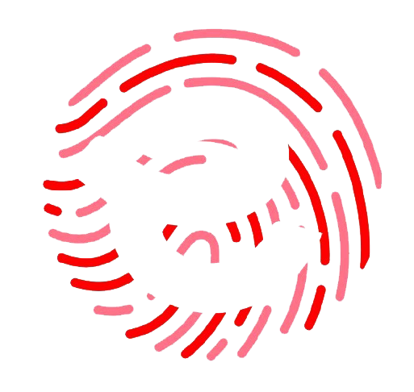

# 📱 IWA - Aplikasi Absensi Mobile

<div align="center">
  
  
  <h3>Sistem Absensi Digital Internal</h3>
  
  <p>
    <strong>Modern • Reliable • User-Friendly</strong>
  </p>
  
  <p>
    
    
    
    
  </p>
</div>

---

## 🎯 Tentang Aplikasi

IWA adalah aplikasi mobile untuk sistem absensi karyawan dengan fitur:
- ✅ **Face Detection** - Absensi menggunakan deteksi wajah
- 📍 **GPS Tracking** - Validasi lokasi saat absensi
- 📴 **Offline Mode** - Tetap bisa absen tanpa internet
- 📊 **Dashboard** - Statistik kehadiran real-time
- 🏖️ **Manajemen Cuti** - Ajukan dan track cuti
- ⏰ **Manajemen Lembur** - Ajukan dan track lembur
- 🔔 **Notifikasi** - Push notification untuk reminder
- 👥 **Team Calendar** - Lihat jadwal tim

---

## 📸 Screenshots

<div align="center">
  
  
  
  
</div>

---

## 🚀 Quick Start

### Prerequisites
- Flutter SDK 3.x
- Android Studio / VS Code
- Android device/emulator (API 21+)

### Installation

1. **Clone & Navigate**
   ```bash
   cd iwareabsenku
   ```

2. **Install Dependencies**
   ```bash
   flutter pub get
   ```

3. **Configure API**
   Edit `lib/utils/constants.dart`:
   ```dart
   static const String baseUrl = 'http://YOUR_SERVER_IP:3000/api';
   ```

4. **Run**
   ```bash
   flutter run
   ```

5. **Build APK**
   ```bash
   flutter build apk --release
   ```

📖 **Panduan lengkap:** Lihat [PANDUAN_SETUP.md](PANDUAN_SETUP.md)

---

## 📋 Fitur Lengkap

### 🔐 Autentikasi
- Login dengan email/password
- Register akun baru
- Verifikasi OTP
- Auto-login & session management

### 📅 Absensi
- Check-in/out dengan face detection
- Capture selfie otomatis
- Validasi lokasi GPS
- Mode offline dengan auto-sync
- Riwayat absensi (harian/mingguan/bulanan)

### 🏖️ Cuti
- Ajukan berbagai tipe cuti
- Upload dokumen pendukung
- Track status approval
- Lihat sisa kuota cuti

### ⏰ Lembur
- Ajukan lembur
- Track status approval
- Riwayat & total jam lembur

### 📊 Dashboard & Statistik
- Status absensi real-time
- Grafik kehadiran
- Statistik personal
- Kalender tim

### 👤 Profil
- Edit profil & foto
- Ubah password
- Pengaturan notifikasi

### 🔔 Notifikasi
- Push notifications (FCM)
- Local notifications
- Badge counter

### 👨‍💼 Admin Panel
- Dashboard admin
- Kelola karyawan
- Approve/reject cuti & lembur
- Laporan kehadiran

---

## 🛠️ Tech Stack

### Core
- **Flutter** 3.x - UI Framework
- **Dart** 3.x - Programming Language
- **Provider** - State Management

### Networking & Storage
- **Dio** - HTTP Client
- **SharedPreferences** - Local Storage
- **Connectivity Plus** - Network Status

### Camera & ML
- **Camera** - Camera Access
- **Google ML Kit** - Face Detection

### Location & Maps
- **Geolocator** - GPS Location

### Notifications
- **Flutter Local Notifications** - Local Notifications
- **Firebase Messaging** - Push Notifications (optional)

### UI Components
- **FL Chart** - Charts & Graphs
- **Cached Network Image** - Image Caching
- **Image Picker** - Image Selection
- **Google Fonts** - Custom Fonts

---

## 📁 Project Structure

```
iwareabsenku/
├── lib/
│   ├── main.dart                 # Entry point
│   ├── models/                   # Data models
│   ├── services/                 # API & business logic
│   ├── screens/                  # UI screens
│   │   ├── auth/                 # Login, register, OTP
│   │   ├── employee/             # Employee features
│   │   └── admin/                # Admin features
│   ├── widgets/                  # Reusable widgets
│   └── utils/                    # Helpers & constants
├── assets/
│   └── images/                   # Images & icons
├── android/                      # Android config
└── ios/                          # iOS config (future)
```

---

## 🔧 Configuration

### API Endpoint
Edit `lib/utils/constants.dart`:
```dart
class ApiConstants {
  static const String baseUrl = 'http://YOUR_IP:3000/api';
}
```

### Permissions (Android)
Already configured in `AndroidManifest.xml`:
- Camera
- Location (GPS)
- Internet
- Storage
- Notifications

### Firebase (Optional)
For push notifications:
1. Create Firebase project
2. Download `google-services.json`
3. Place in `android/app/`
4. Uncomment FCM code in `lib/services/fcm_service.dart`

---

## 🧪 Testing

### Run Tests
```bash
flutter test
```

### Analyze Code
```bash
flutter analyze
```

### Check for Updates
```bash
flutter pub outdated
```

---

## 📦 Build & Deploy

### Debug Build
```bash
flutter build apk --debug
```

### Release Build
```bash
flutter build apk --release
```

### App Bundle (Play Store)
```bash
flutter build appbundle --release
```

### Install to Device
```bash
adb install build/app/outputs/flutter-apk/app-release.apk
```

---

## 🐛 Troubleshooting

### Common Issues

**"Unable to connect to server"**
- Check backend is running
- Verify IP address in `constants.dart`
- Ensure device and server on same network

**"Camera permission denied"**
- Go to Settings → Apps → IWA → Permissions
- Enable Camera permission

**"Face not detected"**
- Ensure good lighting
- Position face in center
- Remove mask/sunglasses

**"Gradle build failed"**
```bash
flutter clean
flutter pub get
flutter run
```

📖 **More solutions:** See [PANDUAN_SETUP.md](PANDUAN_SETUP.md)

---

## 📊 Status

✅ **Production Ready**

- ✅ All core features implemented
- ✅ No compilation errors
- ✅ Tested on Android devices
- ✅ Offline mode working
- ✅ Face detection working
- ⚠️ 45 info-level warnings (non-critical)

📄 **Detailed status:** See [MOBILE_APP_STATUS.md](MOBILE_APP_STATUS.md)

---

## 🗺️ Roadmap

### v1.1 (Future)
- [ ] iOS support
- [ ] Biometric login (fingerprint/face ID)
- [ ] Multi-language (EN/ID)
- [ ] Dark mode toggle
- [ ] Export reports (PDF/Excel)

### v1.2 (Future)
- [ ] Internal messaging
- [ ] Multiple office locations
- [ ] Shift scheduling
- [ ] Payroll integration

---

## 📝 Documentation

- [Setup Guide](PANDUAN_SETUP.md) - Panduan lengkap setup & deployment
- [Status Report](MOBILE_APP_STATUS.md) - Status lengkap fitur & teknologi
- [API Documentation](../backend/API.md) - Backend API reference

---

## 🤝 Contributing

Internal project - contributions by team members only.

### Development Workflow
1. Create feature branch
2. Make changes
3. Test thoroughly
4. Submit for review
5. Merge to main

---

## 📄 License

Internal use only - IWA Attendance System

---

## 👥 Team

Developed with ❤️ by IWA Development Team

---

## 📞 Support

For issues or questions:
- Check documentation first
- Contact development team
- Create internal ticket

---

<div align="center">
  <p><strong>IWA - Sistem Absensi Digital Internal</strong></p>
  <p>Version 1.0.0 • Last Updated: May 2026</p>
</div>
