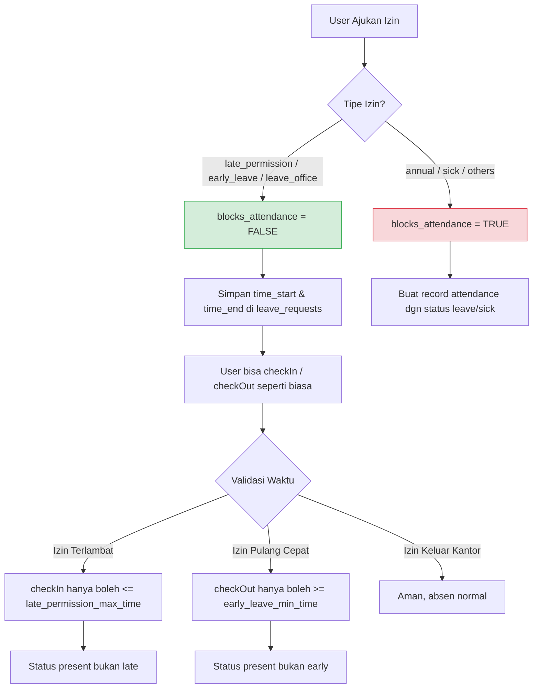
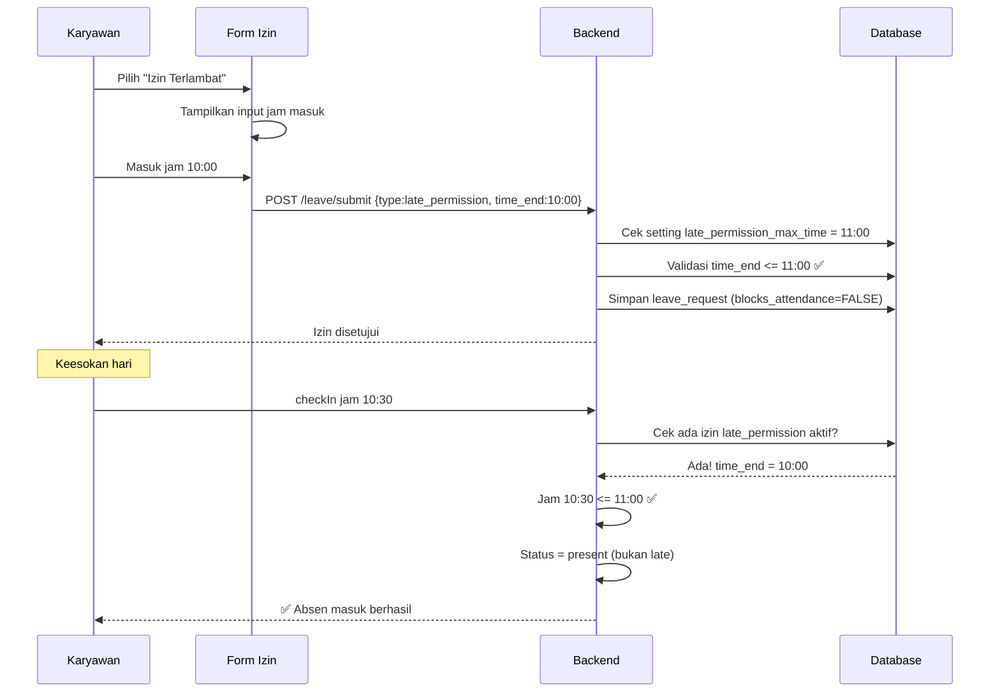

# Rencana Implementasi: Konfigurasi Waktu Izin Terlambat, Pulang Cepat, dan Keluar Kantor

## 1. Ringkasan Kebutuhan

| Jenis Izin | Kode | Perilaku | Batas Waktu |
|-----------|------|----------|-------------|
| Izin Terlambat | `late_permission` | ✅ Bisa absen MASUK (tidak diblokir) — status tetap `present` | Maksimal jam 11:00 WIB (configurable) |
| Izin Pulang Cepat | `early_leave` | ✅ Bisa absen PULANG (tidak diblokir) | Minimal jam 13:00 WIB (configurable) |
| Izin Keluar Kantor | `leave_office` | ✅ Bisa absen MASUK & PULANG normal | Maksimal 2 jam (120 menit, configurable) |
| Izin/Cuti lainnya | `annual`, `sick`, dll | ❌ Tidak bisa absen (diblokir) | Tidak ada |

## 2. Arsitektur Solusi



## 3. Perubahan Database

### 3a. Tabel `leave_types` — Tambah 2 Kolom

```sql
ALTER TABLE leave_types
  ADD COLUMN blocks_attendance BOOLEAN DEFAULT TRUE AFTER deducts_quota,
  ADD COLUMN max_duration_minutes INT DEFAULT NULL AFTER blocks_attendance;
```

> `blocks_attendance = FALSE` → izin tidak membuat record absensi otomatis, user tetap bisa checkIn/checkOut
> `max_duration_minutes` → untuk `leave_office` = 120

### 3b. Tabel `leave_requests` — Tambah Kolom Waktu

```sql
ALTER TABLE leave_requests
  ADD COLUMN time_start TIME DEFAULT NULL AFTER end_date,
  ADD COLUMN time_end TIME DEFAULT NULL AFTER time_start;
```

> `time_start` = jam mulai izin (contoh: izin telat masuk jam 10:00, izin keluar jam 10:00)
> `time_end` = jam selesai izin (contoh: izin pulang cepat jam 14:00, kembali keluar jam 12:00)

### 3c. Tabel `app_settings` — Tambah Setting Baru

```sql
INSERT INTO app_settings (setting_key, setting_value, description) VALUES
('late_permission_max_time', '11:00', 'Batas maksimal jam masuk untuk izin terlambat'),
('early_leave_min_time', '13:00', 'Batas minimal jam pulang untuk izin pulang cepat');
```

### 3d. Update Seed Data leave_types

```sql
-- Update existing leave types
UPDATE leave_types SET blocks_attendance = FALSE WHERE code IN ('late_permission', 'early_leave', 'leave_office');
UPDATE leave_types SET max_duration_minutes = 120 WHERE code = 'leave_office';
```

## 4. Perubahan Backend

### 4a. [`leaveController.js`](backend/src/controllers/leaveController.js) — Ubah `finalizeApproval`

```javascript
const finalizeApproval = async (leave) => {
  const [ltRows] = await pool.query(
    'SELECT deducts_quota, blocks_attendance FROM leave_types WHERE code = ?',
    [leave.type]
  );

  // Kurangi quota jika perlu
  if (ltRows[0]?.deducts_quota) {
    // ... existing logic
  }

  // ✅ JIKA TIDAK MEMBLOKIR ABSENSI, JANGAN BUAT RECORD ATTENDANCE
  if (ltRows[0]?.blocks_attendance === false) return;

  // ✅ JIKA MEMBLOKIR, buat record attendance seperti biasa
  // ... existing logic (leave / sick)
};
```

### 4b. [`attendanceController.js`](backend/src/controllers/attendanceController.js) — Ubah `checkIn`

```diff
  // Cek apakah sudah check-in
  const [existing] = await pool.query('SELECT * FROM attendances WHERE user_id = ? AND date = ?', [userId, today]);
  if (existing.length && existing[0].check_in) {
    return res.status(400).json({ success: false, message: 'Kamu sudah absen masuk hari ini' });
  }

+ // CEK IZIN NON-BLOCKING HARI INI (late_permission / leave_office)
+ const [todayPermits] = await pool.query(
+   `SELECT lr.*, lt.blocks_attendance, lt.max_duration_minutes FROM leave_requests lr
+    JOIN leave_types lt ON lr.type = lt.code
+    WHERE lr.user_id = ? AND lr.status = 'approved'
+      AND lt.blocks_attendance = FALSE
+      AND lr.start_date <= ? AND lr.end_date >= ?`,
+   [userId, today, today]
+ );
+ 
+ let isPermitted = false;
+ let permitMaxTime = null;
+ for (const p of todayPermits) {
+   if (p.type === 'late_permission' || p.type === 'leave_office') {
+     isPermitted = true;
+     permitMaxTime = p.type === 'late_permission' ? p.time_end : null;
+   }
+ }
+ 
+ // VALIDASI IZIN TERLAMBAT
+ if (isPermitted && permitMaxTime) {
+   const now = nowWIB();
+   const [maxH, maxM] = permitMaxTime.split(':').map(Number);
+   const maxMinutes = maxH * 60 + maxM;
+   const nowMinutes = now.getHours() * 60 + now.getMinutes();
+   if (nowMinutes > maxMinutes) {
+     return res.status(400).json({
+       success: false,
+       message: `Batas maksimal izin terlambat adalah pukul ${permitMaxTime} WIB`
+     });
+   }
+ }
```

### 4c. [`attendanceController.js`](backend/src/controllers/attendanceController.js) — Ubah `checkOut`

```diff
  if (existing[0].check_out) return res.status(400).json({ success: false, message: 'Kamu sudah absen pulang hari ini' });

+ // CEK IZIN NON-BLOCKING HARI INI (early_leave / leave_office)
+ const [todayPermits] = await pool.query(/* ...query sama seperti di checkIn... */);
+ 
+ let isPermitted = false;
+ let permitMinTime = null;
+ for (const p of todayPermits) {
+   if (p.type === 'early_leave' || p.type === 'leave_office') {
+     isPermitted = true;
+     permitMinTime = p.type === 'early_leave' ? p.time_start : null;
+   }
+ }
+ 
+ // VALIDASI IZIN PULANG CEPAT
+ if (isPermitted && permitMinTime) {
+   const now = nowWIB();
+   const [minH, minM] = permitMinTime.split(':').map(Number);
+   const minMinutes = minH * 60 + minM;
+   const nowMinutes = now.getHours() * 60 + now.getMinutes();
+   if (nowMinutes < minMinutes) {
+     return res.status(400).json({
+       success: false,
+       message: `Izin pulang cepat minimal pukul ${permitMinTime} WIB`
+     });
+   }
+ }
```

### 4d. [`attendanceController.js`](backend/src/controllers/attendanceController.js) — Ubah logic status

```diff
  // Status saat ini: late jika > workStart + tolerance
- const status = nowMinutes > workStartMinutes ? 'late' : 'present';
+ // Jika ada izin non-blocking, status selalu 'present'
+ let status;
+ if (isPermitted) {
+   status = 'present'; // ✅ PENTING: izin non-blocking = hadir, bukan terlambat
+ } else {
+   status = nowMinutes > workStartMinutes ? 'late' : 'present';
+ }
```

### 4e. [`leaveController.js`](backend/src/controllers/leaveController.js) — Ubah `submitLeave`

```diff
+ // Untuk jenis izin tertentu, validasi jam
+ if (leaveType.code === 'late_permission') {
+   const [setting] = await pool.query(
+     "SELECT setting_value FROM app_settings WHERE setting_key = 'late_permission_max_time'"
+   );
+   const maxTime = setting[0]?.setting_value || '11:00';
+   // time_start dari form = jam berapa user akan masuk
+   // time_end = maxTime (configurable)
+ }
+ 
+ if (leaveType.code === 'early_leave') {
+   const [setting] = await pool.query(
+     "SELECT setting_value FROM app_settings WHERE setting_key = 'early_leave_min_time'"
+   );
+   const minTime = setting[0]?.setting_value || '13:00';
+   // time_start = minTime (configurable) — minimal jam pulang
+   // time_end dari form = jam berapa user akan pulang
+ }
```

## 5. Perubahan Frontend Web

### 5a. [`SettingsAdmin.jsx`](frontend/src/pages/admin/SettingsAdmin.jsx) — Tambah Setting Baru

Di bagian "Jam Kerja", tambahkan:

```jsx
{/* Batas Izin Terlambat */}
<div>
  <label>Batas Maksimal Izin Terlambat</label>
  <input type="time" value={settings.late_permission_max_time || '11:00'}
    onChange={e => setSettings({...settings, late_permission_max_time: e.target.value})} />
  <p className="text-xs text-slate-400">Karyawan dengan izin terlambat harus masuk sebelum jam ini</p>
</div>

{/* Batas Minimal Izin Pulang Cepat */}
<div>
  <label>Batas Minimal Izin Pulang Cepat</label>
  <input type="time" value={settings.early_leave_min_time || '13:00'}
    onChange={e => setSettings({...settings, early_leave_min_time: e.target.value})} />
  <p className="text-xs text-slate-400">Karyawan dengan izin pulang cepat hanya bisa pulang setelah jam ini</p>
</div>
```

### 5b. [`LeavePage.jsx`](frontend/src/pages/employee/LeavePage.jsx) — Form Izin

Untuk jenis izin `late_permission` tampilkan:
```
Jam Masuk Rencana: [ 10:00 ]
Batas Maksimal: 11:00 WIB (otomatis dari setting)
```

Untuk jenis izin `early_leave` tampilkan:
```
Jam Pulang Rencana: [ 14:00 ]
Batas Minimal: 13:00 WIB (otomatis dari setting)
```

### 5c. [`AttendancePage.jsx`](frontend/src/pages/employee/AttendancePage.jsx)

Tampilkan info izin aktif di atas tombol absen:
```
📋 Izin Terlambat Hari Ini — Maksimal masuk 11:00 WIB
📋 Izin Pulang Cepat Hari Ini — Minimal pulang 13:00 WIB
📋 Izin Keluar Kantor Hari Ini (10:00 - 12:00)
```

## 6. Perubahan Flutter Mobile

### 6a. [`leave_screen.dart`](iwareabsenku/lib/screens/employee/leave_screen.dart)

Di tab "Ajukan Izin", untuk `late_permission` dan `early_leave`:
- Tambah input jam (TimePicker)
- Validasi waktu sesuai setting

### 6b. [`attendance_screen.dart`](iwareabsenku/lib/screens/employee/attendance_screen.dart)

- Tambah info izin aktif hari ini
- Jika ada izin non-blocking, status badge tetap `present` bukan `late`

### 6c. [`api_service.dart`](iwareabsenku/lib/services/api_service.dart)

```dart
Future<Map<String, dynamic>> submitLeave(
  String type, String startDate, String endDate, String reason,
  {File? attachment, String? timeStart, String? timeEnd}
) async {
  // tambah time_start dan time_end ke FormData
}
```

## 7. Alur Validasi Lengkap



## 8. Daftar File yang Dimodifikasi

| File | Perubahan |
|------|-----------|
| `database/schema.sql` | ALTER TABLE leave_types + leave_requests + INSERT app_settings |
| `backend/src/controllers/leaveController.js` | `finalizeApproval` skip non-blocking; `submitLeave` validasi waktu |
| `backend/src/controllers/attendanceController.js` | `checkIn` validasi late_permission; `checkOut` validasi early_leave; status=present untuk izin |
| `backend/src/controllers/leaveTypeController.js` | CRUD untuk field baru blocks_attendance, max_duration_minutes |
| `frontend/src/pages/admin/SettingsAdmin.jsx` | Input late_permission_max_time, early_leave_min_time |
| `frontend/src/pages/admin/LeaveTypesAdmin.jsx` | Toggle blocks_attendance, input max_duration_minutes |
| `frontend/src/pages/employee/LeavePage.jsx` | Input jam untuk late_permission & early_leave |
| `frontend/src/pages/employee/AttendancePage.jsx` | Info izin non-blocking aktif |
| `iwareabsenku/lib/screens/employee/leave_screen.dart` | Input jam + validasi waktu |
| `iwareabsenku/lib/screens/employee/attendance_screen.dart` | Info izin non-blocking + status present |
| `iwareabsenku/lib/services/api_service.dart` | Parameter time_start, time_end di submitLeave |

## 9. Kesimpulan

**Ya, semua bisa dikonfigurasi** melalui:
1. **Admin Settings** — setting waktu batas izin (Web UI)
2. **Leave Types** — flag `blocks_attendance` per jenis izin (Web UI)
3. **Backend** — validasi otomatis saat checkIn/checkOut
4. **Mobile & Web** — tampilan form dan info yang sesuai

Tidak perlu hardcode nilai seperti 11:00 atau 13:00 — semuanya tersimpan di `app_settings` dan bisa diubah kapan saja oleh admin.

Apakah Anda ingin saya lanjutkan dengan implementasi?